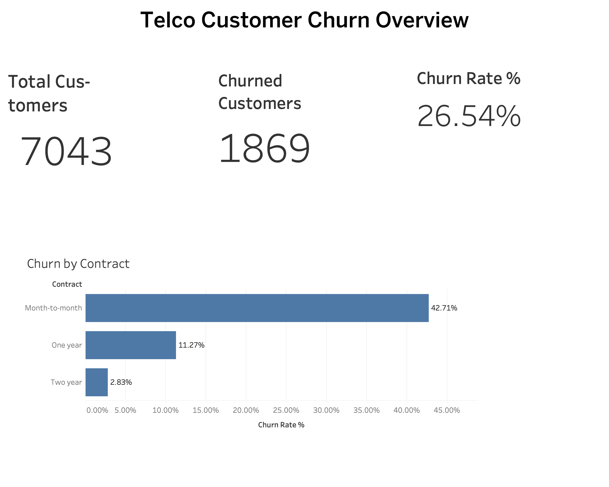

# Customer Churn Risk Analysis

## Overview
This project analyzes telecom customer churn data to quantify overall churn risk, identify high-risk customer segments, and present business-ready insights through a Tableau dashboard. The workflow includes data cleaning, segmentation analysis, metric computation, and visualization.

## Dataset
The dataset represents telecom customer information, including contract type, tenure, payment method, internet service, and churn status.  
- Source: Telco Customer Churn dataset (public dataset)  
- Size: ~7,000 customer records  
- Key fields: churn status, contract type, tenure, monthly charges  

## Business Problem
Customer churn directly impacts revenue and growth. Businesses need to understand:
- how many customers are leaving
- the overall churn rate
- which customer segments are most at risk  

This enables targeted retention strategies and reduces revenue loss.

## Objectives
- Measure total customers
- Calculate churned customers
- Compute overall churn rate
- Identify churn patterns across contract types
- Build a business-friendly dashboard for decision-making

## Methodology
1. Data ingestion from raw CSV dataset  
2. Data cleaning and preprocessing using Python  
3. Feature segmentation (contract, payment method, internet service)  
4. Aggregation of churn metrics  
5. Export of processed datasets  
6. Dashboard creation in Tableau  

## Tools Used
- Python  
- Pandas  
- Tableau  
- CSV  

## Dashboard Preview

## Key Insights
- Total customers: **7,043**  
- Churned customers: **1,869**  
- Overall churn rate: **26.54%**  
- Month-to-month contracts have significantly higher churn rates  
- Long-term contracts reduce churn risk  

## Project Files
- `dashboard/telco-customer-churn-dashboard.twbx` — Tableau dashboard  
- `images/telco-customer-churn-dashboard.png` — dashboard preview  
- `src/` — data cleaning, segmentation, modeling, and summary scripts  
- `data/` — raw and processed datasets  

## How to Use
- Open the Tableau workbook:  
  `dashboard/telco-customer-churn-dashboard.twbx`  
- Review processed data in `data/processed/`  
- Inspect analysis scripts in `src/`  

## Conclusion
Customer churn is a significant business risk in the telecom dataset, with month-to-month customers contributing disproportionately to churn. The dashboard provides a clear, business-oriented view of churn metrics and supports data-driven retention strategies.
