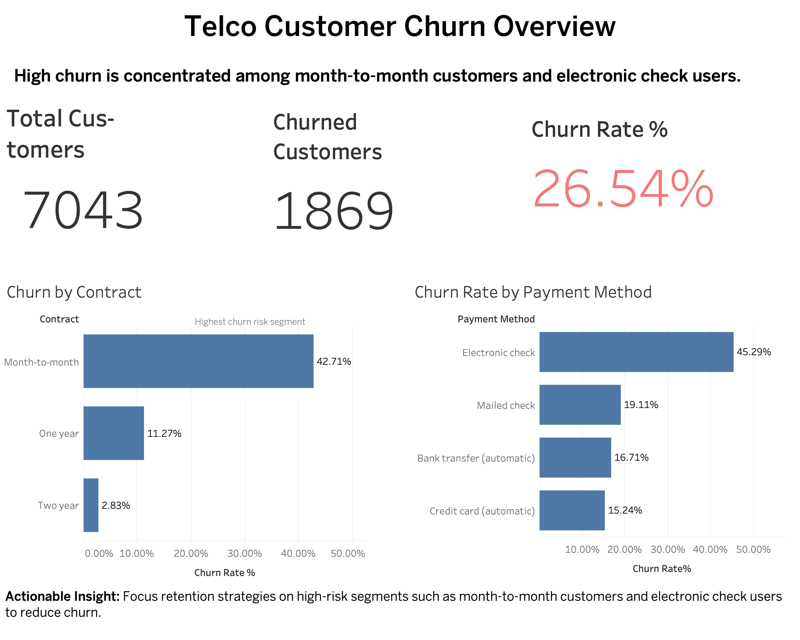

# Customer Churn Prediction & Retention Strategy

Predictive churn analytics project using real telecom customer data to identify high-risk customers, estimate revenue at risk, and prioritize retention actions.

---

## Headline Metrics

- **ROC-AUC:** 0.8421
- **Recall:** 78.88%
- **370** high-risk customers identified
- **$23,961.83** estimated monthly revenue at risk
- **$2,396.18** potential monthly revenue saved if 10% of high-risk customers are retained

---

## Business Problem

Customer churn reduces recurring revenue and long-term customer value. The business needs to understand:

- which customers are most likely to churn
- what factors drive churn risk
- how churn risk translates into revenue exposure
- which retention actions should be prioritized first

Without this visibility, retention efforts remain broad and inefficient.

---

## Project Objective

This project was built to transform churn analysis from a descriptive dashboard into a decision-support system by:

1. identifying the strongest churn drivers
2. predicting churn probability at the customer level
3. estimating business impact of churn risk
4. recommending prioritized retention strategies

---

## Dataset

- **Source:** Telco Customer Churn dataset
- **Records:** 7,043 customers
- **Features:** demographics, services, billing, contract type, churn status

Key fields include:

- `Contract`
- `tenure`
- `MonthlyCharges`
- `PaymentMethod`
- `InternetService`
- `Churn`

---

## Analytical Approach

### 1. Data Preparation
- cleaned and validated customer records
- converted `TotalCharges` to numeric
- removed non-informative identifiers
- prepared categorical and numeric variables for modeling

### 2. Exploratory Churn Analysis
- churn rate by contract type
- churn rate by payment method
- churn rate by internet service
- average tenure and monthly charges by churn status

### 3. Predictive Modeling
- logistic regression model
- stratified train/test split
- balanced class weighting
- preprocessing pipeline with imputation and one-hot encoding

---

## Model Performance

| Metric | Value |
|--------|-------|
| Accuracy | 73.74% |
| Precision | 50.34% |
| Recall | 78.88% |
| ROC-AUC | 0.8421 |

### Why this model is useful

The model is strong enough for retention decision-making:

- high recall helps identify most likely churners
- moderate precision is acceptable in campaign targeting
- ROC-AUC of 0.8421 shows strong separation between churn and non-churn customers

In this context, missing a true churner is more costly than targeting a customer who may not churn.

---

## Key Drivers of Churn

### Higher Churn Risk
- month-to-month contracts
- fiber optic internet users
- electronic check payment method
- customers without online security
- customers without tech support

### Lower Churn Risk
- two-year contracts
- customers with bundled services and support

These results indicate that contract structure, support services, and billing behavior are major churn drivers.

---

## Estimated Business Impact

The model identified **370 high-risk customers** with churn probability greater than or equal to 70%.

| Metric | Value |
|--------|-------|
| Average Monthly Revenue per Customer | $64.76 |
| Monthly Revenue at Risk | $23,961.83 |
| Potential Monthly Revenue Saved (10% retained) | $2,396.18 |

### Strategic insight

Even modest retention gains can protect meaningful recurring revenue. This makes churn prediction useful not just for analysis, but for prioritizing revenue-focused interventions.

---

## Prioritized Action Plan

### 1. Convert Month-to-Month Customers
- highest churn-risk segment
- strongest contract-related intervention opportunity

### 2. Target High-Risk Customers Using Churn Scores
- focus campaigns on customers with the highest predicted churn probability
- improve retention efficiency and reduce wasted effort

### 3. Improve Service Bundle Retention
- promote online security and tech support bundles
- address service-related churn drivers

### Business recommendation

> Retention-focused investment is likely to deliver higher ROI than equivalent acquisition spend for this customer base.

---

## Dashboard

### Customer Churn Risk Dashboard

This dashboard highlights:

- overall churn KPIs
- churn concentration across contract types
- churn patterns by payment method and internet service
- segment-level insights that support retention planning

### Tableau Deliverable

- `dashboard/telco-customer-churn-dashboard.twbx`

---

## Project Outputs

- `outputs/tables/churn_model_metrics.csv`
- `outputs/tables/churn_confusion_matrix.csv`
- `outputs/tables/churn_classification_report.csv`
- `outputs/tables/top_15_churn_drivers.csv`
- `outputs/tables/customer_churn_scored_sample.csv`
- `outputs/tables/churn_business_impact_summary.csv`
- `models/churn_model_summary.json`

---

## SQL Analysis

SQLite queries were used to validate business-facing churn metrics, including:

- total customers
- churned customers
- overall churn rate
- churn rate by contract type
- churn rate by payment method

See `sql/churn_analysis.sql`.

---

## Analytical Considerations

- the dataset does not include acquisition channel or satisfaction data
- results are observational rather than causal
- churn behavior may vary across segments and over time
- model performance may differ in real production settings

---

## Conclusion

This project combines churn analysis, predictive modeling, business impact estimation, and retention prioritization to support better customer strategy decisions.

The core conclusion is clear:

**Targeted retention actions can materially reduce revenue loss and should be prioritized over broad, untargeted churn interventions.**
